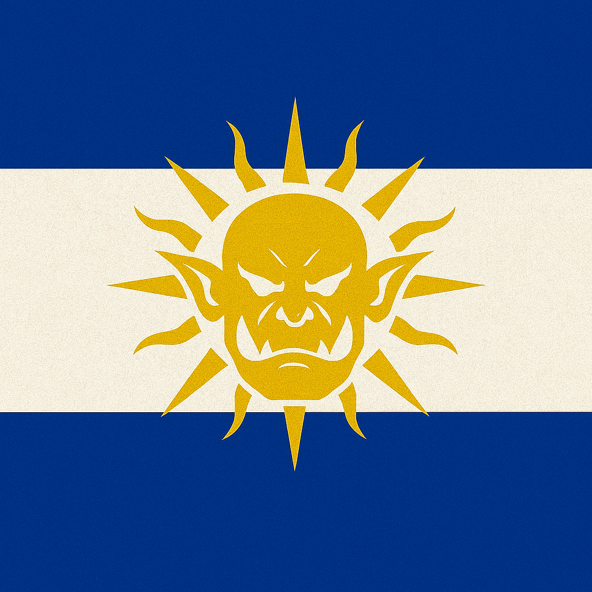

# 17XX Der Streit um Regalistra

Die Insel **Regalistra** – einst ein abgelegener Außenposten, heute das Zentrum eines schwelenden Konflikts. Ihre fruchtbaren Täler, seltenen Erze und magischen Quellen haben die Aufmerksamkeit zweier Mächte geweckt:

Das **Königreich Freidorien**, ein stolzer Zwergenstaat, sieht in Regalistra ein Erbe alter Bergvölker und beansprucht die Insel als Teil seiner historischen Domäne.

Die **Republik Lamecru**, eine aufstrebende Orknation, betrachtet Regalistra als Schlüssel zur wirtschaftlichen Unabhängigkeit – ein Ort, an dem Handel, Expansion und neue Gesellschaftsformen gedeihen könnten.

Zwischen Diplomatie, Spionage und offenen Scharmützeln beginnt ein Wettlauf um Einfluss, Ressourcen und die Zukunft der Insel. _Regalistra_ selbst schweigt – doch ihre Wälder, Städte und Ruinen beobachten genau, wer würdig ist, sie zu formen.
