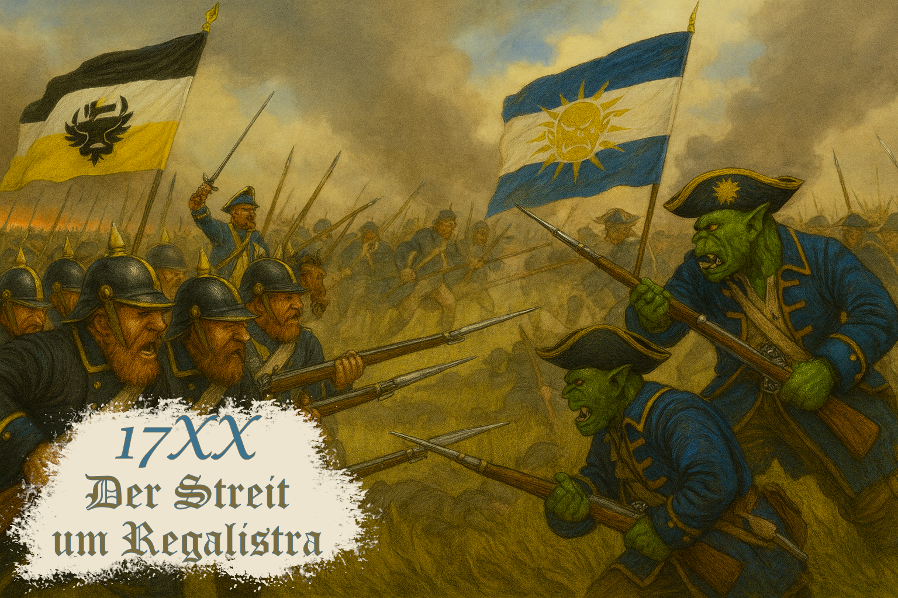

# 17XX Der Streit um Regalistra

Die Insel **Regalistra** – einst ein abgelegener Außenposten, heute das Zentrum eines schwelenden Konflikts. Ihre fruchtbaren Täler, seltenen Erze und magischen Quellen haben die Aufmerksamkeit zweier Mächte geweckt:

  
  

    <strong>Königreich Freidorien</strong> 
    Das Königreich Freidorien, ein stolzer Zwergenstaat, sieht in Regalistra ein Erbe alter Bergvölker und beansprucht die Insel als Teil seiner historischen Domäne.
  

 

  
  

    <strong>Republik Lamecru</strong> 
    Die Republik Lamecru, eine aufstrebende Orknation, betrachtet Regalistra als Schlüssel zur wirtschaftlichen Unabhängigkeit – ein Ort, an dem Handel, Expansion und neue Gesellschaftsformen gedeihen könnten.
  

 

Zwischen Diplomatie, Spionage und offenen Scharmützeln beginnt ein Wettlauf um Einfluss, Ressourcen und die Zukunft der Insel. _Regalistra_ selbst schweigt – doch ihre Wälder, Städte und Ruinen beobachten genau, wer würdig ist, sie zu formen.

## Gameplay-Elemente

### Kernmechaniken
- **Region-basierte Weltkarte**: Strategische Kartenbewegung auf Pfaden
- **Regionalverwaltung**: 14 Regionen mit eigenständigen Daten und Eigenschaften
- **Fraktionssystem**: Zwei spielbare Fraktionen (Zwerge, Orks) mit eigenen Ressourcen und Einfluss
- **Echtzeitzyklen**: Tag-Nacht-Wechsel und Zeitmanagement

### Spieler & Bewegung
- **Playercontroller**: Direkte Charaktersteuerung auf der Karte
- **Pathfinding**: Spline-basierte Pfadfindung für intelligente Bewegungswege
- **Kamerasystem**: Freie Kamera-Steuerung mit Zoom und Rotation

### Fraktionen & Diplomatie
- **Fraktionsverwaltung**: Verfolgung von Ressourcen, Einfluss und Status
- **Regionenkontrolle**: Jede Region kann von einer Fraktion kontrolliert werden
- **Standorte**: Orte von strategischer oder wirtschaftlicher Bedeutung

### UI & Interaktion
- **Dynamische UI**: USS/UXML-basierte Oberflächen

### Lokalisierung
- **Mehrsprachigkeit**: Deutsche Lokalisierung implementiert
- **Kartenbeschriftungen**: Lokalisierte Regionen- und Ortsnamen

### Audio & Atmosphäre
- **Day-Night-Controller**: Visuelle und atmosphärische Zyklen

## Requirements

### Systemanforderungen
- Windows 10 oder höher
- 8 GB RAM (mindestens)
- 10 GB freier Festplattenspeicher
- GPU mit mindestens 2 GB VRAM

### Entwicklungsumgebung
- Unity 2022 LTS oder höher
- .NET Framework 4.8+ oder .NET 6.0+
- Visual Studio Code oder Visual Studio 2022
- Git für Versionskontrolle